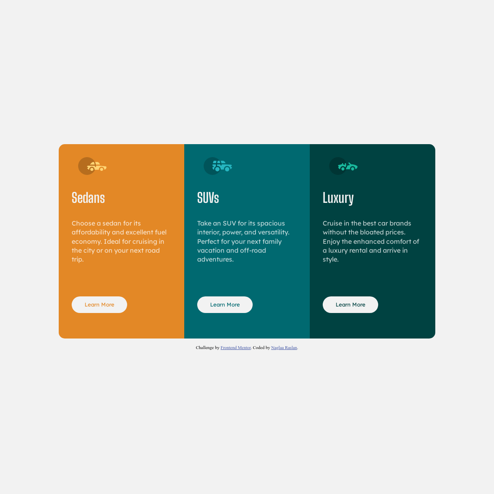
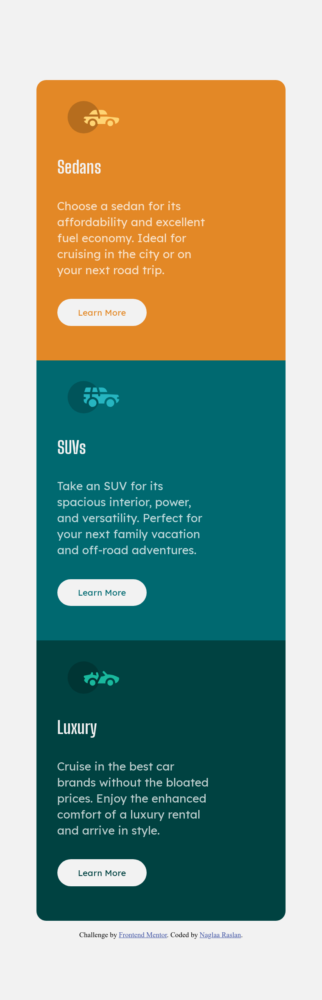

# Frontend Mentor - 3-column preview card component solution

This is a solution to the [3-column preview card component challenge on Frontend Mentor](https://www.frontendmentor.io/challenges/3column-preview-card-component-pH92eAR2-). Frontend Mentor challenges help you improve your coding skills by building realistic projects. 

## Table of contents

- [Overview](#overview)
  - [The challenge](#the-challenge)
  - [Screenshot](#screenshot)
  - [Links](#links)
- [My process](#my-process)
  - [Built with](#built-with)
  - [What I learned](#what-i-learned)
  - [Continued development](#continued-development)
  - [Useful resources](#useful-resources)
- [Author](#author)
- [Acknowledgments](#acknowledgments)

**Note: Delete this note and update the table of contents based on what sections you keep.**

## Overview

### The challenge

Users should be able to:

- View the optimal layout depending on their device's screen size
- See hover states for interactive elements

### Screenshot
- Desktop screenshot:;
- Mobile screenshot:;

### Links

- Solution URL: [Gihub repo](https://github.com/naglorias/3-column-preview-card.git)
- Live Site URL: [Live site](https://naglorias.github.io/3-column-preview-card/)

## My process

### Built with

- Semantic HTML5 markup
- CSS custom properties
- CSS Grid
- Mobile-first workflow

**Note: These are just examples. Delete this note and replace the list above with your own choices**

### What I learned

- I learned how to build responsive grid layout design that goes along with different sizes;

## Author

- Website - [Github profile](github.com/naglorias)
- Frontend Mentor - [@naglorias](https://www.frontendmentor.io/profile/naglorias)
- Twitter - [twitter profile](https://twitter.com/naglaRn)

**Note: Delete this note and add/remove/edit lines above based on what links you'd like to share.**

